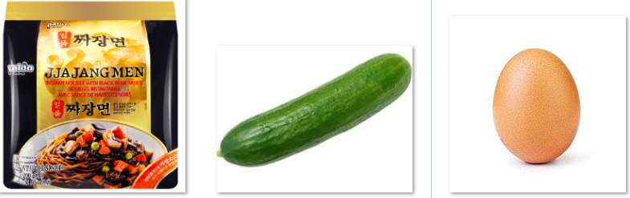

<style>
@import url('https://fonts.googleapis.com/css2?family=Roboto+Mono&family=Roboto+Slab&family=Source+Sans+Pro:wght@300;400&display=swap');
</style> 

```{r setup, include=FALSE}
knitr::opts_chunk$set(echo = FALSE,
                      fig.align = "center",
                      fig.height = 7,
                      fig.width = 10.5)

if (!require(pacman)) install.packages('pacman', repos = 'https://cran.rstudio.com')
pacman::p_load(tidyverse, here, dplyr, ggplot2, learnr, fontawesome, sortable)
```

## 1. Welcome!


#### Hey college students:

##### Good news, today you'll put good food on your table. Get ready. Good food can by easy and you can do it with minimum effort!

#### Let's get started. Click below to learn how to cook *"Super Jiang Ramen"*.


## 2. Super Jiang Ramen

### You need these ingredients:


### What you do is very simple:

First you want to make egg noodles. Add a tiny pinch of salt and pepper and beat the egg until completely blended. Pour the liquid into a hot, oil covered frying pan, spread it into a thin sheet and wait for a few seconds till it's done. Take the sheet out, let it chill, (go make your ramen now is a good idea to save time), then cut it into noodles.

Then cook your ramen in boiling water following the instruction (always read the instruction!). When it's done, drain the water and add in the black sauce, finely mix them together.

Last step is cutting half the cucumber into thin sticks and add all things together. A good idea might be add a pinch of salt in the cucumber. 

Enjoy!


### Want to check if you're ready to cook? Answer the following question before you go!


```{r ramen}
# define the answer options
ramen <- c(
  "make egg noodles",
  "cook the ramen and drain the water",
  "mix the ramen and sauce",
  "cut the cucumber into thin sticks",
  "put them together, add salt to your taste"
)

# question

question_rank(
  "What's the recommended order of these steps?",
  answer(ramen, correct = TRUE, message = "Yes, you got it!"),
  answer(rev(ramen), correct = FALSE, message = "Oops, think twice!"),
  allow_retry = TRUE
)

```


